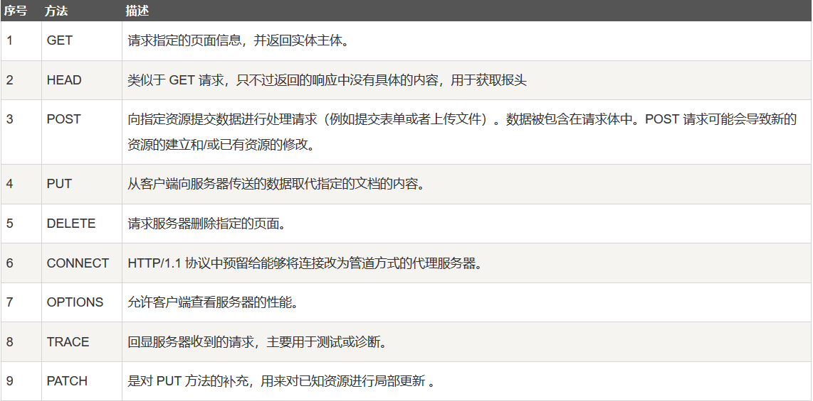
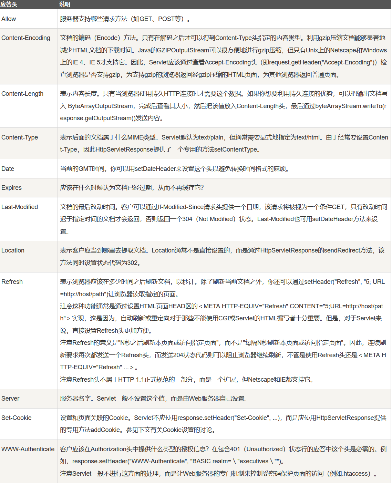
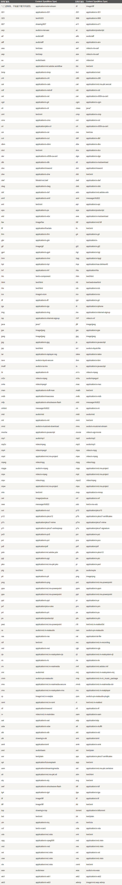
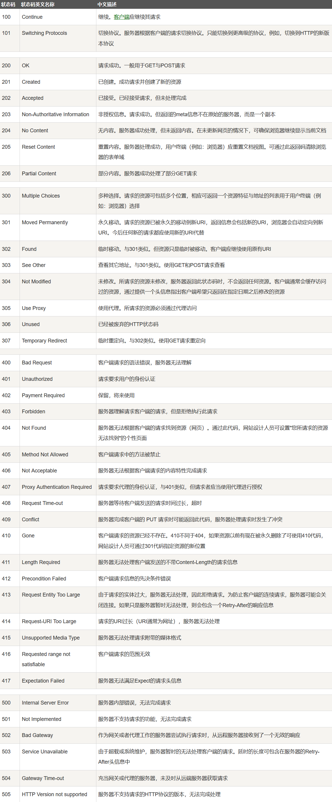
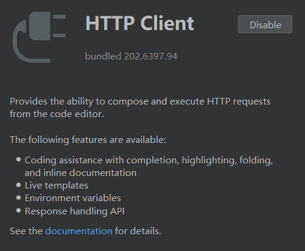

# HTTP学习记录


## HTTP基础知识


### HTTP的三个性质
- HTTP是无连接：无连接的含义是限制每次连接只处理一个请求。服务器处理完客户的请求，并收到客户的应答后，即断开连接。采用这种方式可以节省传输时间。
- HTTP是媒体独立的：这意味着，只要客户端和服务器知道如何处理的数据内容，任何类型的数据都可以通过HTTP发送。客户端以及服务器指定使用适合的MIME-type内容类型。
- HTTP是无状态：HTTP协议是无状态协议。无状态是指协议对于事务处理没有记忆能力。缺少状态意味着如果后续处理需要前面的信息，则它必须重传，这样可能导致每次连接传送的数据量增大。另一方面，在服务器不需要先前信息时它的应答就较快。

### HTTP的九种请求方法
根据 HTTP 标准，HTTP 请求可以使用多种请求方法：
- `HTTP1.0`定义了三种请求方法：`GET`、`POST`、`HEAD`方法。
- `HTTP1.1`新增了六种请求方法：`OPTIONS`、`PUT`、`PATCH`、`DELETE`、`TRACE`、`CONNECT`方法。



### HTTP请求与相应


### HTTP请求头


### HTTP内容类型


### HTTP返回码
HTTP返回码的分类及描述
- `1**` : 信息，服务器收到请求，需要请求者继续执行操作
- `2**` : 成功，操作被成功接收并处理
- `3**` : 重定向，需要进一步的操作以完成请求
- `4**` : 客户端错误，请求包含语法错误或无法完成请求
- `5**` : 服务器错误，服务器在处理请求的过程中发生了错误



## HTTP强化训练

### 新建HTTP请求
需要IDEA支持的`HTTP Client`插件：<br/>



新建一个`HTTP Requests`文件就可以啦：<br/>


### HTTP请求返回数据
以`to-baidu.http`为例，返回数据为：
```http request
GET http://www.baidu.com

HTTP/1.1 200 OK
Content-Type: text/html
Server: bfe
Date: Tue, 25 Aug 2020 06:36:30 GMT

<!DOCTYPE html>
<!--STATUS OK-->
<html>
<head>
    <meta http-equiv=content-type content=text/html;charset=utf-8>
    <meta http-equiv=X-UA-Compatible content=IE=Edge>
    <meta content=always name=referrer>
    <link rel=stylesheet type=text/css href=http://s1.bdstatic.com/r/www/cache/bdorz/baidu.min.css>
    <title>百度一下，你就知道</title></head>
<body link=#0000cc>
<div id=wrapper>
    <div id=head>
        <div class=head_wrapper>
            <div class=s_form>
                <div class=s_form_wrapper>
                    <div id=lg></div>
                    <form id=form name=f action=//www.baidu.com/s class=fm><input type=hidden name=bdorz_come value=1>
                        <input type=hidden name=ie value=utf-8> <input type=hidden name=f value=8> <input type=hidden
                                                                                                          name=rsv_bp
                                                                                                          value=1>
                        <input type=hidden name=rsv_idx value=1> <input type=hidden name=tn value=baidu><span
                                class="bg s_ipt_wr"><input id=kw name=wd class=s_ipt value maxlength=255
                                                           autocomplete=off autofocus></span><span
                                class="bg s_btn_wr"><input type=submit id=su value=百度一下 class="bg s_btn"></span>
                    </form>
                </div>
            </div>
            <div id=u1><a href=http://news.baidu.com name=tj_trnews class=mnav>新闻</a> <a href=http://www.hao123.com
                                                                                             name=tj_trhao123
                                                                                             class=mnav>hao123</a> <a
                    href=http://map.baidu.com name=tj_trmap class=mnav>地图</a> <a href=http://v.baidu.com
                                                                                     name=tj_trvideo
                                                                                     class=mnav>视频</a> <a
                    href=http://tieba.baidu.com name=tj_trtieba class=mnav>贴吧</a>
                <noscript><a
                        href=http://www.baidu.com/bdorz/login.gif?login&amp;tpl=mn&amp;u=http%3A%2F%2Fwww.baidu.com%2f%3fbdorz_come%3d1
                        name=tj_login class=lb>登录</a></noscript>
                <script>document.write('<a href="http://www.baidu.com/bdorz/login.gif?login&tpl=mn&u=' + encodeURIComponent(window.location.href + (window.location.search === "" ? "?" : "&") + "bdorz_come=1") + '" name="tj_login" class="lb">登录</a>');</script>
                <a href=//www.baidu.com/more/ name=tj_briicon class=bri style="display: block;">更多产品</a></div>
        </div>
    </div>
    <div id=ftCon>
        <div id=ftConw><p id=lh><a href=http://home.baidu.com>关于百度</a> <a href=http://ir.baidu.com>About
            Baidu</a></p>
            <p id=cp>&copy;2017&nbsp;Baidu&nbsp;<a href=http://www.baidu.com/duty/>使用百度前必读</a>&nbsp; <a
                    href=http://jianyi.baidu.com/ class=cp-feedback>意见反馈</a>&nbsp;京ICP证030173号&nbsp; </p></div>
    </div>
</div>
</body>
</html>
```
